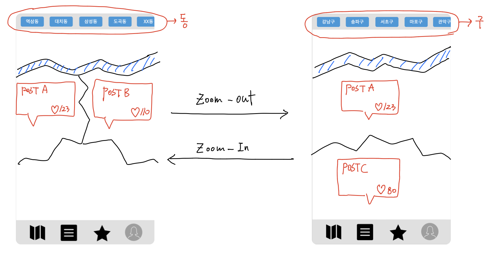
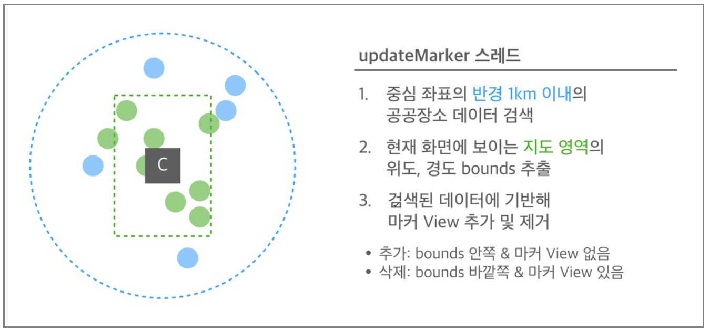
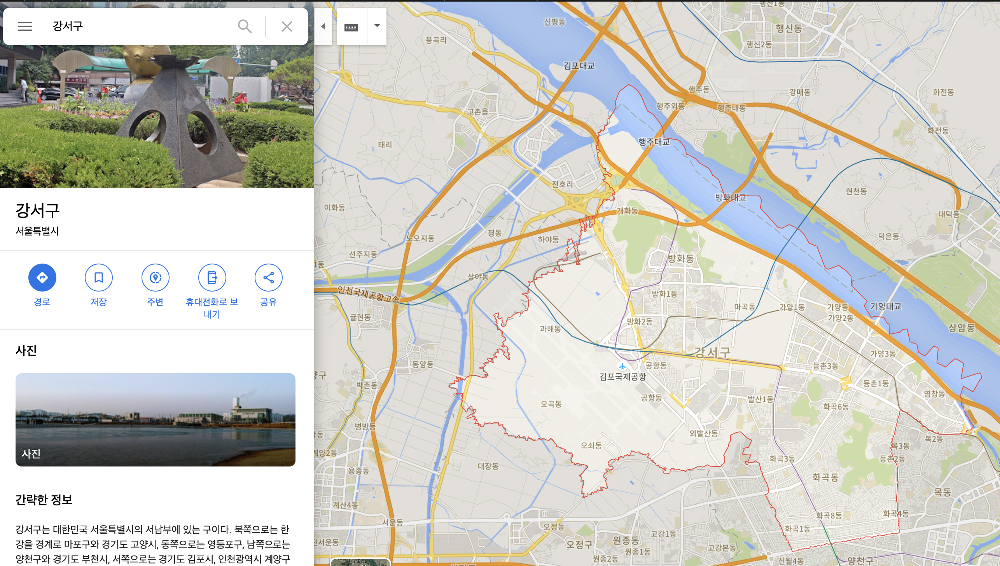

# 프로젝트 요약

## 프로젝트 명: JYS(Jido Younghyangryuk Seonggongjuck)

나의 입지를 한눈에 보여주는 JYS(지도영향력성공적, 가제)

## 프로젝트 요약

map에 가장 like가 많은 post만 보이는 SNS, 나의 영향력을 한눈에 볼 수 있다.

## 프로젝트 키워드

SNS, Mobile Application

## 목적 및 필요성

1. user가 올리는 사진 또는 영상이 다른 사람들에게 얼마나 많은 공감을 받는지 확인
2. user가 사는 지역에서 나의 talent로 유명하지만 과연 다른 지역에서도 먹힐지 확인

## 프로젝트 개요

기존의 SNS의 대명사인 facebook과 instagram을 봤을 때 타임라인 형태는 user와 가까운(친밀한) 사람들이 올린 콘텐츠, user가 관심있는 콘텐츠만 볼 수 있게 특화되어 있다.

JYS는 현재위치에 콘텐츠를 올리는 방식으로 그 위치 주변의 모든 콘텐츠들을 볼 수 있으며, 그 지역에서 가장 핫한 콘텐츠를 한눈에 볼 수 있다.

또한 내가 올린 콘텐츠가 다른 사람과의 like 경쟁을 할 수 있는 구도여서 사용자가 올린 콘텐츠가 어느정도의 영향력, 공감을 받을 수 있는지 알 수 있다.

**대표기능**

특정 지역에서 콘텐츠를 올리게 되면 기존의 타임라인 형태로 올라가게 된다.
일반 콘텐츠들은 모두 타임라인 형태로 올라가게 되며 콘텐츠가 하나의 지역 테두리 안에서 like 수가 가장 많으면 map tab에서 그 콘텐츠만 보이게 된다.

<b>**여기서 부터 핵심**</b>

예를 들면 대한민국 강남구에서 올린 콘텐츠가 A와 B가 있다고 하자 A는 like의 수가 123개이고 B는 like 수가 110개이다.
그렇다면 map에서 강남구 지역의 콘텐츠는 A하나만 보이게 된다.
또한 C라는 콘텐츠가 송파구에서 like의 수가 80개라고 하면 map을 다시 줌 아웃했을 때 서울이라는 지역 테두리 내에서는 A라는 콘텐츠 하나만 보이게 된다.

이런식으로 특정지역에서 가장 핫한 콘텐츠가 무엇인지 가려낼 수 있으며 누구나 이런 콘텐츠 챌린지에 참가할 수 있다.

## 기술 스택 및 협업 방법

### Back - end

docker를 이용해 여러개의 Express.js 서버 컨테이너를 만들어 k8s로 오케스트레이션을 하고, nginx를 이용해 load balancing하는 것을 최우선적인 목표로 두고 있다. ( 이 경우 트래픽이 몰려 서버가 죽을 확률이 높다. DevOps에 의존적이다. )

그 외 spring이나 spring boot를 고려할 수 있다. ( 이 경우 DevOps는 상대적으로는 신경 쓸 필요는 없을 듯 하다. )

DB는 mongoDB같은 noSQL이나 위치기반서비스에 최적화된 PostgreSQL을 사용한다.

* WAS: node.js, spring
* DB: MongoDB, PostgreSQL
* DevOps: k8s, nginx, docker

### Front - end(Moblie App)

iOS 개발을 하는 것을 우선적인 목표로 한다.

SwiftUI를 이용해 MVVM 패턴을 적용할 것이며, UIKit은 사용하지 않는다. 부득이하게 UIKit을 사용할 경우 UIViewRepresentable 을 이용한다.

### 그 외

publishing 까지 염두를 하고 있다면 Jenkins를 이용하도록 한다.

협업 툴은 trello와 slack을 이용하도록 한다.

형상관리는 github을 이용한다.

## 생각 해봐야하는 것

가장 큰 문제는 지도 data의 수급과 많은 데이터를 응답해줘야 할 때 이다.

* 지도는 각 지역의 경계선이 json 좌표 형태로 되어있는 것이 이상적이다.

  한국의 지도 데이터는 [여기](https://github.com/southkorea/southkorea-maps)를 한번 참고하는 것이 좋다.

  미국의 경우 본 프로젝트 제안서 폴더에 "03_us-states.json"을 보도록 한다.
  (좌표를 넣으면 PostgreSQL에서 면적이나, 그 좌표를 안에 있는지의 여부를 계산을 해준다고 들었는데 자세히 찾아봐야함.)

* 사용자가 늘어남에 따라 지도가 지저분 해질 수 있다. 이 같은 경우는 아래 알고리즘을 이용하면 해결될 듯하다.

  

* 지도에서 각 시군구를 자를예정이라면 구글맵, 네이버맵등 지원해주는 API가 있는지 확인해봐야한다.
  없을 경우 맵을 직접 제작을 해야하는데...

  

  Google Map 자체에서는 시, 군, 구 , 동 입력했을 시 표시가 되는데 [여기](https://stackoverflow.com/questions/9706484/add-search-area-outline-onto-google-maps-result)에서는 안될거라고 말하는데 한번 찾아봐야함.

  우리가 필요한 내용은

  * GPS 좌표 입력 시 여기가 어디 구역 내인지 판별
    * 흐음 ...
  * 구역 이름(e.x. 강서구, 삼성동 ... ) 입력 시 지도에서 하이라이팅

## Persona

**Case1.**

강원도 태백에 사는 소녀가 자신의 동네에서는 인기가 많다.
그러나 소녀는 자신이 다른 지역에서도 얼마나 인기가 많은지 알고싶다.
JYS에 컨텐츠를 올리자 사람들의 반응은 폭발적이었다. 자신의 동내 뿐만아니라 강원도내, 더 나아가 대한민국에서 가장 인기가 많았다.
평범한 소녀지만 그녀는 SNS스타가 되었고 사람들의 이목을 집중받았다.

**Case2.**

프랑스 여행을 다녀온 한국인 A씨는 프랑스 여행도중 몽마르뜨언덕에서 JYS를 이용해 사진을 하나 올렸다. 사진은 사람들에게 폭발적인 반응을 얻었고 몽마르뜨 지역에서는 A씨의 사진이 가장 인기가 많아서 그 사진하나만 보인다.
한국에 돌아온 A씨는 앱을 통해 그 상황을 보고 있다.

